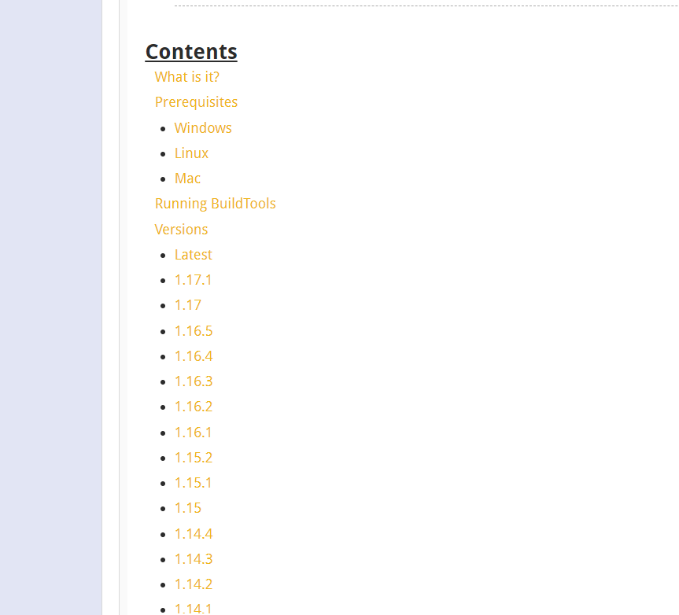
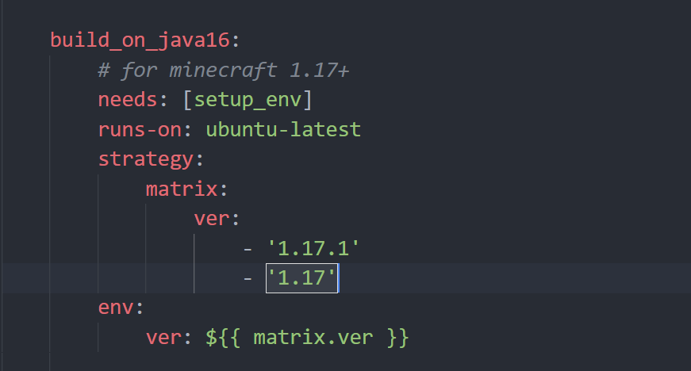

# Spigot-Generaror

**[简体中文]|[English](./docs/README-EN.md)**

**如果本项目帮到了你, 麻烦点个star⭐⭐⭐吧~~**

本项目使用 `Github` 的 `Actions` 功能自动构建 `Spigot` 的核心.
免去自己 `Build` 的烦恼, 解决网络不通畅导致的构建失败问题.

## 自动构建时间:
每月 `1号` 和 `16号` 的 `18点30分`

## 下载地址:
本项目 [Release](https://github.com/Youkii-Chen/Spigot-Generaror/releases) 页面

## 协助更新此项目
由于 `Minecraft` 的版本迭代速度很快, 如果您发现 `release` 中没有最新的版本核心. 您可以按以下步骤协助更新本项目:
1. 前往 [Spigot文档](https://www.spigotmc.org/wiki/buildtools/) 查询是否已经跟进推出新的版本
   
   如上图所示, 如果 `release` 中没有找到对应的最新版本, 进入第二步.
2. <del>star 本项目(</del>  
`fork` 本项目
3. 修改 `.github/workflows/Build.yml`  
找到 `jobs` > `build_on_java16` > `strategy`  
在 `ver` 中添加 最新版本的选项.  
  
随后, 到文件顶部修改 `env.latest`
4. 提交 `pull request`, 等待我通过即可.